# Shortest Path Finder Using Swing & Java

.txt files are used as database in this project.

### Shortest Path
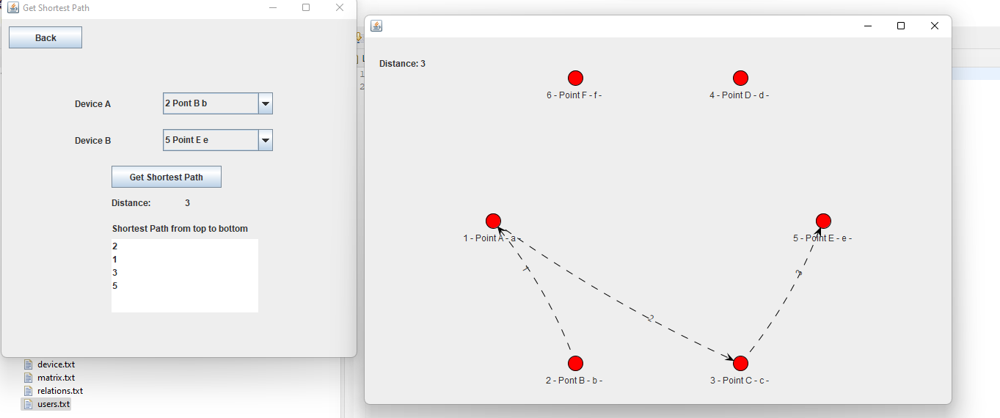
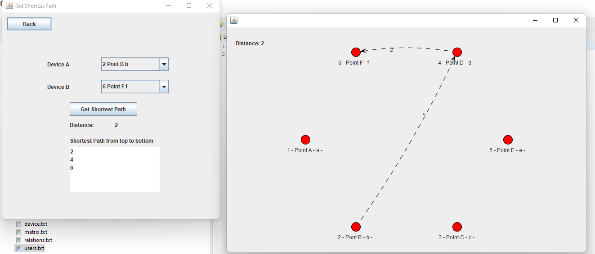

### All Connections
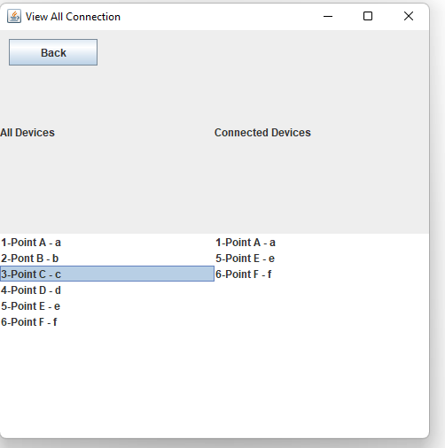

### Device Connection
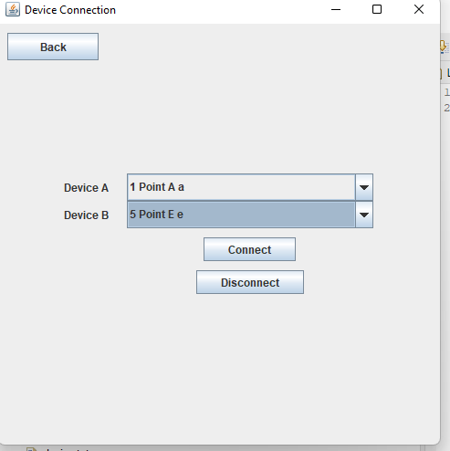

### dashboard
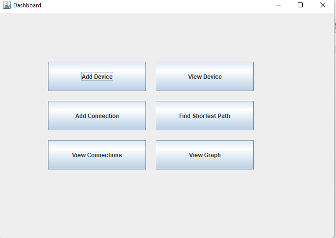

### View Device
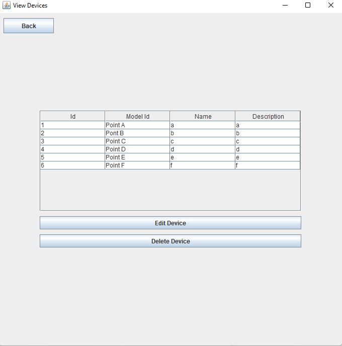

### Add Device
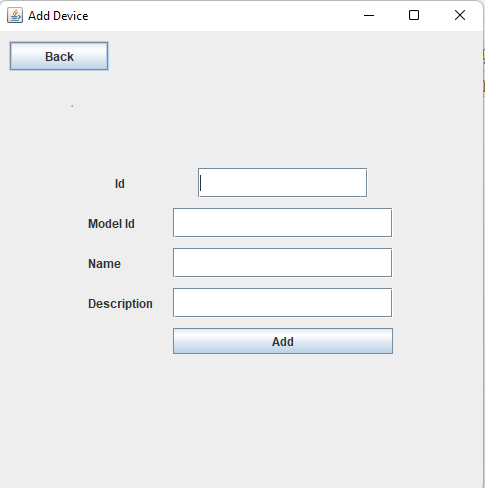

## .Txt Files Storing Data

### Devices
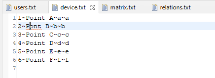

### User
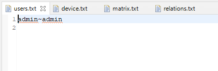

### Matrix || Graph
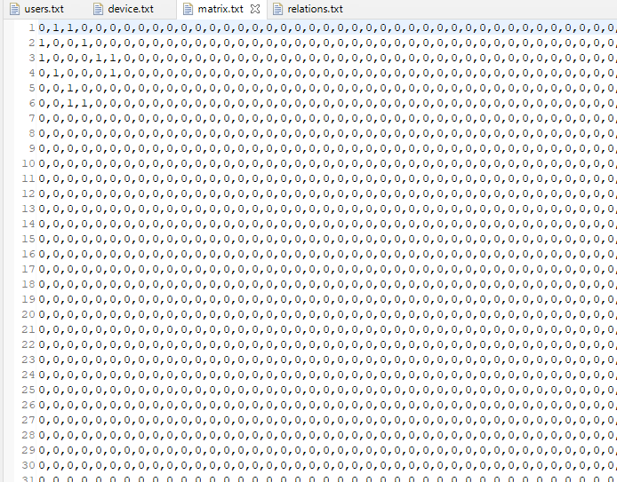

### Relations
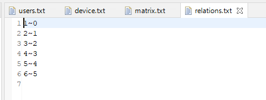